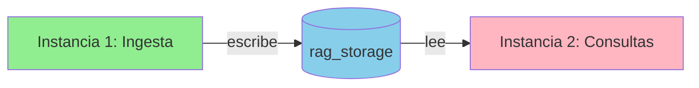

# 🔍 ANÁLISIS: ARQUITECTURA DE DOS INSTANCIAS RAGAnything

**Fecha:** 2025-09-09  
**Problema identificado:** Transferencia de datos entre instancias

---

## 📊 HALLAZGOS CLAVE

### ✅ **COMPARTEN EL MISMO STORAGE**

Ambas instancias usan **exactamente el mismo directorio**:
```python
# Línea 188 - Primera instancia (ingesta)
rag_storage = Path("test_environment/rag_storage")
config = RAGAnythingConfig(working_dir=str(rag_storage))  # línea 308

# Línea 451 - Segunda instancia (consultas)  
rag_storage = Path("test_environment/rag_storage")
config = RAGAnythingConfig(working_dir=str(rag_storage))  # línea 481
```

### 🎯 **NO HAY PROBLEMA DE TRANSFERENCIA**

La arquitectura actual funciona así:

1. **INSTANCIA 1 (Ingesta)** - líneas 316-343
   - Escribe en: `test_environment/rag_storage/`
   - Genera: KG, embeddings, doc_status, full_docs

2. **INSTANCIA 2 (Consultas)** - líneas 482-486
   - Lee de: `test_environment/rag_storage/` (MISMO directorio)
   - Accede a: KG ya construido, embeddings existentes

### 📁 **STORAGE COMPARTIDO**
```
test_environment/rag_storage/
├── kv_store_full_docs.json       ← Ambas usan esto
├── kv_store_doc_status.json      ← Ambas usan esto
├── kv_store_full_entities.json   ← Ambas usan esto
├── kv_store_full_relations.json  ← Ambas usan esto
├── vdb_entities.json              ← Ambas usan esto
├── vdb_relationships.json        ← Ambas usan esto
└── graph_chunk_entity_relation.graphml ← Ambas usan esto
```

---

## ❌ **EL VERDADERO PROBLEMA**

El problema NO es la transferencia de datos, sino la **configuración incompleta** de la segunda instancia:

```python
# PROBLEMA ACTUAL (línea 482-486)
rag = RAGAnything(
    config=config,
    llm_model_func=llm_model_func,
    embedding_func=embedding_func
    # FALTA: vision_model_func ← ESTO ES EL PROBLEMA
)
```

### Por qué falla:
1. LightRAG requiere vision_model_func para inicializarse correctamente
2. Sin vision_model_func, la instancia no puede crear el objeto LightRAG interno
3. Error: "No LightRAG instance available"

---

## ✅ **SOLUCIÓN CONFIRMADA**

**NO necesitamos transferir datos** - ya comparten storage.  
**SÍ necesitamos** configuración completa:

```python
# SOLUCIÓN (agregar en línea 485)
rag = RAGAnything(
    config=config,
    llm_model_func=llm_model_func,
    vision_model_func=vision_model_func,  # ← AGREGAR ESTA LÍNEA
    embedding_func=embedding_func
)
```

---

## 🏗️ **ARQUITECTURA ACTUAL**



### Ventajas de esta arquitectura:
1. ✅ **Separación de concerns**: Ingesta vs Consulta
2. ✅ **Configuración optimizada**: Cada instancia con config específica
3. ✅ **Storage unificado**: No duplicación de datos
4. ✅ **Simplicidad**: No hay transferencia compleja

### Desventajas actuales:
1. ❌ **Configuración inconsistente**: Falta vision_model_func
2. ⚠️ **No hay validación**: No verifica que storage exista antes de consultar

---

## 📋 **RECOMENDACIONES**

### 1. **INMEDIATO** - Fix configuración
```python
# Asegurar MISMA configuración de modelos
shared_models = {
    "llm_model_func": llm_model_func,
    "vision_model_func": vision_model_func,
    "embedding_func": embedding_func
}

# Instancia 1
rag_ingesta = RAGAnything(config_ingesta, **shared_models)

# Instancia 2  
rag_consulta = RAGAnything(config_consulta, **shared_models)
```

### 2. **MEJORA** - Validación de storage
```python
# Antes de crear instancia de consultas
if not rag_storage.exists() or not any(rag_storage.iterdir()):
    raise ValueError("Storage vacío - ejecutar ingesta primero")
```

### 3. **FUTURO** - Clase unificada
```python
class RAGAnythingDual:
    """Maneja automáticamente ingesta y consultas con config óptima"""
    def __init__(self, base_config, model_funcs):
        self.ingesta = RAGAnything(config_ingesta, **model_funcs)
        self.consulta = RAGAnything(config_consulta, **model_funcs)
```

---

## ✅ **CONCLUSIÓN**

**NO HAY PROBLEMA DE TRANSFERENCIA DE DATOS**
- Ambas instancias comparten el mismo storage
- Los datos persisten en disco entre instancias
- La arquitectura es correcta

**EL ÚNICO PROBLEMA ES:**
- Falta `vision_model_func` en segunda instancia
- Solución: agregar una línea de código

**PRÓXIMO PASO:**
Aplicar el fix de vision_model_func y validar funcionamiento completo.